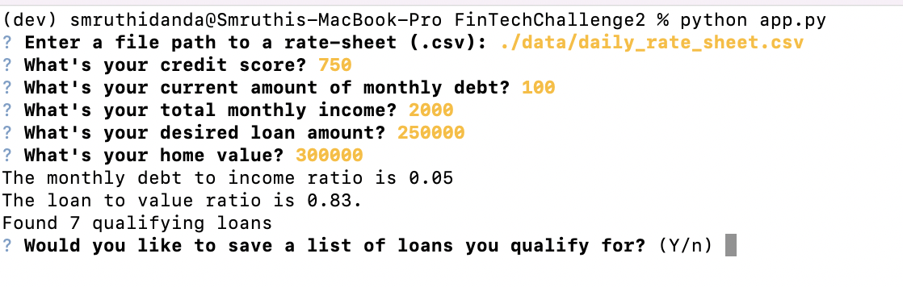

# FinTechChallenge2

---

## Technologies

This project uses Python 3.9.
We installed the following packages:
* [fire](https://github.com/google/python-fire) - Fire explantion
* [questionary](https://github.com/tmbo/questionary) - Questionary Explanation

---

## Installation Guide

Please install the following packages before running the program:
```
pip install fire
pip install questionary
```

---

## Purpose of project:

Given a csv file of loans that are available, save the loans that you qualify for based on information given by user.

---

## Usage

To start the application, run the following:
```
python app.py
```

You will be prompted to enter the location of the qualifying loans. 


After, you will be prompted to enter information needed to determine the loans you qualify for and whether you would like to save the list.


If you decide to save list, you will need to give the output location of the csv file.


---

## Contributors

Smruthi Danda

---

## Licenses

MIT License


